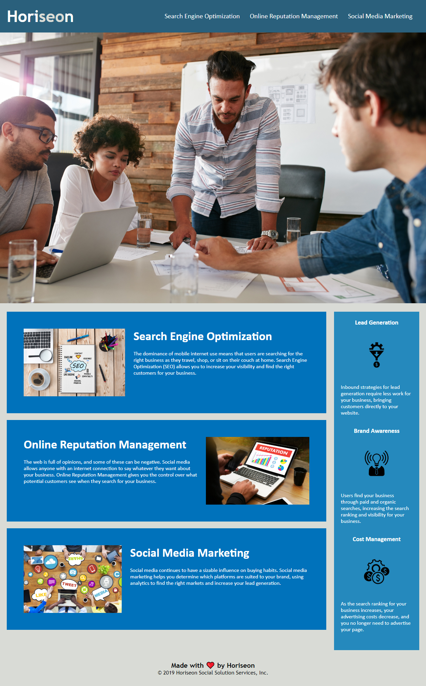

# Challenge 1 - Search Engine Optimalization - HORISEON

## Description

HORISEON Social media marketing website codebase refactor for :

1. *Optimalization of search engines for marketing company*
2. *Increase visibility in internet websites*
3. *Find right customers*
4. *Maximize profits*

I was asked to change code for Horiseon marketing agency website to make it optimised for searching engines and follows accessibly standards.

## Installation

*I have completed code refactor according to HTML Semantics and Image alt atrributes rules to make my challenge complete.
*I have made some changes in CSS structure to have it matched with HTML.
*I have changed website title for better searching results.

## Screenshot

## License

MIT License